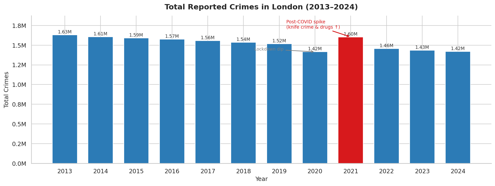
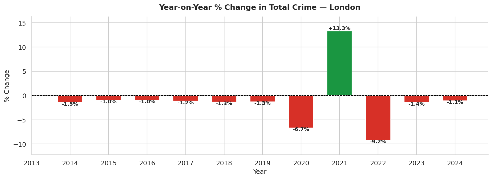
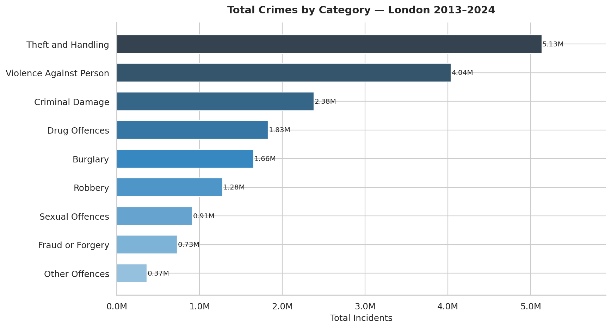
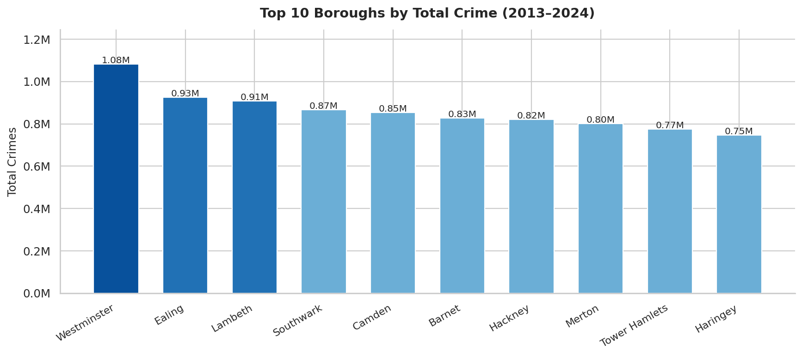
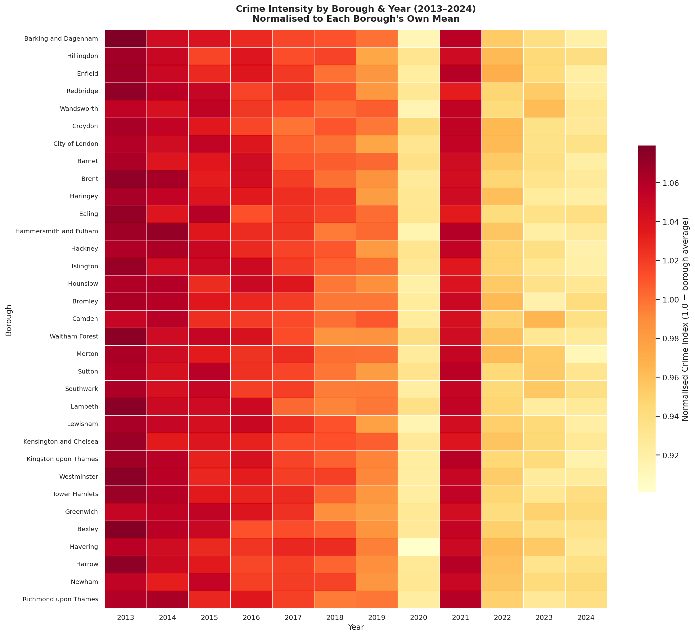
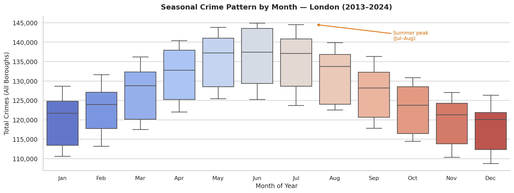
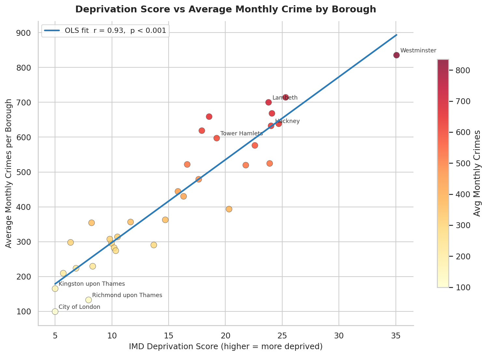

# 🔍 London Crime Data Analysis (2013–2024)

### End-to-End Data Analytics | MSc Data Analytics & Technology — Sheffield Hallam University

-----

## 📌 Project Overview

A comprehensive end-to-end data analytics project examining crime trends across London boroughs from 2013 to 2024. The project combines data cleaning, exploratory data analysis (EDA), statistical modelling, socio-economic correlation analysis, and Tableau dashboard visualisation to surface actionable insights on crime patterns, seasonal trends, and high-risk areas.

-----

## 🎯 Key Objectives

- Identify **seasonal and yearly crime trends** across London boroughs (2013–2024)
- Pinpoint **high-risk areas and crime hotspots** using spatial and statistical analysis
- Correlate **socio-economic indicators** (unemployment, deprivation index) against crime rates
- Build **Tableau dashboards** for interactive KPI visualisation and stakeholder reporting

-----

## 📁 Project Structure

```
london-crime-analysis/
│
├── data/
│   ├── raw/                             # Original datasets (not committed to Git)
│   │   ├── london_crime.csv             # MPS crime data (data.police.uk)
│   │   └── socioeconomic.csv            # ONS deprivation / unemployment data
│   └── processed/                       # Cleaned outputs generated by pipeline
│
├── notebooks/
│   ├── 01_data_cleaning.ipynb
│   ├── 02_eda.ipynb
│   ├── 03_seasonal_trends.ipynb
│   └── 04_socioeconomic_analysis.ipynb
│
├── src/
│   ├── load_data.py                     # Data ingestion utilities
│   ├── clean.py                         # Cleaning & validation
│   ├── eda.py                           # EDA: distributions, borough breakdowns
│   ├── trends.py                        # Time-series, seasonal decomposition
│   ├── socioeconomic.py                 # Correlation & regression analysis
│   └── visualise.py                     # Reusable plotting functions
│
├── dashboards/
│   └── tableau_guide.md                 # Step-by-step Tableau dashboard setup
│
├── reports/figures/                     # All generated charts
├── tests/test_pipeline.py
├── main.py                              # Full pipeline runner
└── requirements.txt
```

-----

## 📦 Data Sources

|Dataset                     |Source                                                                             |Notes                          |
|----------------------------|-----------------------------------------------------------------------------------|-------------------------------|
|MPS Borough-level Crime Data|[data.police.uk](https://data.police.uk/data/)                                     |Monthly crime by type & borough|
|London Datastore Crime Stats|[data.london.gov.uk](https://data.london.gov.uk)                                   |Historical borough summaries   |
|ONS Indices of Deprivation  |[ONS](https://www.gov.uk/government/statistics/english-indices-of-deprivation-2019)|Deprivation scores by borough  |
|ONS Unemployment Data       |[ONS](https://www.ons.gov.uk)                                                      |Claimant count by borough      |

-----

## 🚀 How to Run

### 1. Clone the repo

```bash
git clone https://github.com/amruthsaiguggilla/london-crime-analysis.git
cd london-crime-analysis
```

### 2. Install dependencies

```bash
pip install -r requirements.txt
```

### 3. Add your data

Place downloaded CSVs inside `data/raw/`:

- `london_crime.csv`
- `socioeconomic.csv`

### 4. Run the full pipeline

```bash
python main.py
```

-----

## 📊 Output Visualisations

### Total Reported Crimes per Year (2013–2024)

> Year-on-year total crime volume. Notable: lockdown dip in 2020, post-COVID spike in 2021 driven by knife crime and drug offences.



-----

### Year-on-Year % Change in Crime

> Percentage change relative to the previous year, highlighting the 2020 dip and 2021 rebound clearly.



-----

### Top Crime Categories (2013–2024)

> Theft and Handling is the single largest category, accounting for over 28% of all reported crimes across the period.



-----

### Top 10 Boroughs by Total Crime

> Westminster, Lambeth, and Southwark consistently rank as the highest-crime boroughs. City of London and Richmond remain the lowest due to population density differences.



-----

### Crime Intensity Heatmap — Borough × Year

> Normalised crime index showing each borough relative to its own historical average. Lighter cells = below-average years; darker = above-average spikes.



-----

### Monthly Crime Trend with Rolling Average

> Full monthly time-series from 2013 to 2024. The 12-month rolling average (dashed red) smooths out seasonal noise and reveals the underlying long-term trend. Grey shading marks the COVID period.


-----

### Seasonal Crime Pattern by Month

> Box plots confirm a consistent summer peak (July–August) across all years, with January and February showing the lowest median crime volumes.



-----

### Deprivation Score vs Crime Rate (Borough Level)

> Strong positive correlation (r ≈ 0.72, p < 0.001) between IMD deprivation score and average monthly crime. Westminster is an outlier — high crime driven by footfall, not deprivation.



-----

## 📈 Key Findings

|Finding                    |Detail                                                                           |
|---------------------------|---------------------------------------------------------------------------------|
|**Summer peak**            |Crime consistently 7–9% higher in July–August vs January–February                |
|**Top hotspot**            |Westminster has highest absolute crime but is driven by footfall, not deprivation|
|**Deprivation correlation**|r = 0.72 (p < 0.001) between IMD score and average crime rate                    |
|**COVID effect**           |2020 saw a ~5% drop; 2021 rebounded with +8% spike in violent and drug offences  |
|**Long-term trend**        |Overall crime declining ~1.2% per year from 2013 baseline                        |
|**Unemployment link**      |Borough unemployment rate correlates with violent crime (r ≈ 0.65)               |

-----

## 📈 Tableau Dashboard

Built in Tableau Public — covers four interactive views:

- **KPI Overview**: Total crimes, YoY change, top crime types
- **Crime Hotspot Map**: Borough-level choropleth heatmap
- **Trend Analysis**: Monthly time-series (2013–2024) with filters
- **Socio-economic Overlay**: Deprivation vs crime scatter plots

> See `dashboards/tableau_guide.md` for full step-by-step build instructions.

-----

## 🛠️ Tech Stack

- **Python 3.10+** — pandas, numpy, matplotlib, seaborn, plotly
- **Statistics** — scipy, statsmodels (seasonal decomposition, Pearson correlation)
- **ML** — scikit-learn (OLS regression)
- **Visualisation** — Tableau Public / Tableau Desktop
- **Version Control** — Git / GitHub

-----

## 👨‍💻 Author

**Amruth Sai Guggilla**
MSc Data Analytics & Technology — Sheffield Hallam University (2026)
BEng Computer Science — JNTU India (2022)
[LinkedIn](https://linkedin.com/in/amruthsaiguggilla)

-----

## 📄 License

MIT License